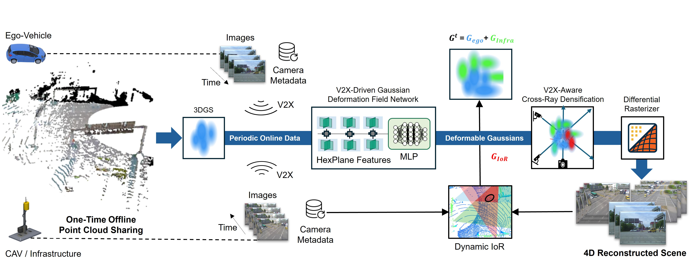

# V2X-Gaussians: Gaussian Splatting for Multi-Agent Cooperative Dynamic Scene Reconstruction
### [Project Page]() | [Paper]() | [Unofficial Implementation](https://github.com/abhishekjagtap1/Collaborative-dynmaic-gaussian-spaltting/tree/dev_depth_flow_supervision)

Abstract— Recent advances in neural rendering, such as
NeRF and Gaussian Splatting, have shown great potential
for dynamic scene reconstruction in intelligent vehicles. However, existing methods rely on a single ego vehicle, suffering
from limited field-of-view and occlusions, leading to incomplete reconstructions. While V2X communication may provide additional information from roadside infrastructure or
other CAVs, it often degrades reconstruction quality due to
sparse overlapping views. In this paper, we propose V2XGaussians, the first framework integrating V2X communication
into Gaussian Splatting. Specifically, by leveraging deformable
Gaussians and an iterative V2X-aware cross-ray densification
approach, we enhance infrastructure-aided neural rendering
and address view sparsity in multi-agent scenarios. In addition,
to support systematic evaluation, we introduce a standardized
benchmark for V2X scene reconstruction. Experiments on realworld data show that our method outperforms state-of-the-art
approaches by +2.09 PSNR with only 561.8 KB for periodic
V2X-data exchange, highlighting the benefits of incorporating
roadside infrastructure into neural rendering for intelligent
transportation systems. 

##  Results Demo 1 - Multi-Agent Cooperative Dynamic Scene Reconsctruction

**Left Column - Infrastructure View 1, Middle Column - EGO-CAV and Right Coloumn - Infrastructure View 2**


##  Results Demo 2 - Enabling Novel View Synthesis with Infrastructure-Aided V2X Communication 
This demo showcases camera pose interpolation among V2X agents, enabling seamless viewpoint transitions.

Note: The synthesized view may appear incomplete or discontinuous due to the limited coverage of the scene by only three agents. The sparsity of these viewpoints results in gaps between perspectives, affecting the smoothness of the interpolation.

  


## News
- [x] Accepted to IEEE IV 2025 
- [x] Release main training code 
- [x] Release data processing code
- [x] Release preprocessed V2X-GOTR evaluation benchmark
- [ ] Release rendering results checkpoints
- [ ] Support for integrating foundational priors like depth, optical flow, and semantic features, along with their corresponding differentiable rasterizers


## Installation

<details> <summary>Clone this repository</summary>

```bash
git clone https://github.com/abhishekjagtap1/V2X-Guassians.git
```
</details>
<details> <summary>Set up the conda environment</summary>

```
conda create -y --name v2x_gaussian python=3.9
conda activate v2x_gaussian
# Replace cu118 with 121 if using CUDA 12.x 
pip install torch==2.4.0 torchvision==0.19.0 torchaudio==2.4.0 --index-url https://download.pytorch.org/whl/cu118
pip install -r requirements.txt
pip install submodules/depth-diff-gaussian-rasterization
pip install submodules/simple-knn
```
</details>

<details> <summary>Prepare V2X-Gaussians On-The-Road (V2X-GOTR) Dataset</summary>

1. Follow the instructions in [V2X-GOTR](docs/V2XGOTR.md) to fully set up the V2X-GOTR benchmark for both training and evaluation.

The V2X-GOTR data loader, located at `scene/V2XGOTR_dataset.py`, is well-documented and responsible for loading all V2X agent data components, including:

- **RGB frames**  
- **Timestamps**  
- **Lidar point clouds**  
- **Camera intrinsics and extrinsics**  

</details>

## Training


To train on V2X-GOTR scenes, use the following command:
```
python train_v2x_gaussians.py -s "path_to_V2X_GOTR_Scene" --port 6017 --expname "Experiment_Name" --configs arguments/multi_agents/v2x_gaussian.py --checkpoint_iterations 40000
```
### Training with Checkpoints

If you want to continue training from a specific checkpoint, run:

```
python train_v2x_gaussians.py -s "path_to_V2X_GOTR_Scene"  --port 6017 --expname "Experiment_Name" --configs arguments/multi_agents/v2x_gaussian.py --start_checkpoint "output/Experiment_Name/chkpnt_fine_5000.pth" # change it.
```
Replace output/Experiment_Name/chkpnt_fine_5000.pth with the actual checkpoint path.

### Quick Training on a Example Scene

Download the example scenario from the following link: [here]([https://www.dropbox.com/scl/fi/k1duzi7fu13ppfno6fgyn/u_turn_maneuver.zip?rlkey=r6ppbl5m2rket1ky8i4wtx3ps&st=041m3oqt&dl=0](https://www.dropbox.com/scl/fo/a34yxthlrgepyjkgbqk6z/ALOW8mcg2w8OOp4xj2Egk4A?rlkey=grfx78f0osi5tg6f6wi0ye2br&st=jtvqr2i0&dl=0))

Extract the contents and locate the path to the example scene directory.

#### Running the Training Script

Once the example scene is extracted, execute the following command to train the model:

```
python train_v2x_gaussians.py -s "path_to_example_scene"  --port 6017 --expname "Experiment_Name" --configs arguments/multi_agents/v2x_gaussian.py  # change data path.
```


## Rendering

To render the images, execute the following script:

```
python render.py --model_path output/Experiment_Name/ --configs arguments/multi_agents/v2x_gaussian.py --skip_video --skip_train
```

## Evaluation

To evaluate the model, use the following script:

```
python metrics.py --model_path "output/Experiment_Name" 
```

## Pre-trained Checkpoints
Pre-trained checkpoints for various scenes are available [here]([https://www.dropbox.com/scl/fi/due9icyvvun59e0vv3g72/u_turn_only_v2x_guided_training.zip?rlkey=h92cp4cctkc5cvkt0gcd1mq2a&st=kz6eeq2b&dl=0](https://www.dropbox.com/scl/fo/dnbmm17sqw68y0igtmcto/APCWK9LvlXF2VfJOrxrUfO4?rlkey=shpdze8pzt6yah1wxkyvvzjjv&e=1&st=iha1bg6s&dl=0))

Extract the contents and locate the path to the output scene directory.

To evaluate and render using these pre-trained checkpoints, run the following commands:

```
python render.py --model_path output/u_turn_only_v2x_guided_training/ --configs arguments/multi_agents/v2x_gaussian.py --skip_video --skip_train
python metrics.py --model_path "output/u_turn_only_v2x_guided_training" 
```
Note: In ```cfg_args``` file, source_path needs to be changed according to your local system path. 
For example: source_path='/home/uchihadj/PycharmProjects/try/data/u_turn_maneuver' needs to be changed to your local example scene directory


## 4D SIBR Viewer
[Watch me](./docs/viewer_usage.md)
## Scripts

There are few helpful scripts:

1. `scene/novel_view_utils.py` contains various novel view pose functions such as `add_noise_to_pose` that adds communication noise to poses during inference


## Pipeline Overview



## Miscellaneous

If you are interested in experimenting with foundational priors such as flow or 2d features and depth please refer to the unoffical experimental implementation at https://github.com/abhishekjagtap1/Collaborative-dynmaic-gaussian-spaltting/tree/dev_depth_flow_supervision

Note: we provide support for different rasterizers  such as flow or feature rasterizer in different branches, refer to `dev_depth_flow_supervision` and `dev_feature_rasterization`.

For easy benchmarking of RT-4dgs, we also provide a dedicated branch named `vanilla_4DGS`

TODO: 
- [ ] Code Cleanup for Emernerf
- [ ] Unofficial implementation of Emernerf on V2X-GOTR benchamrk is available here https://github.com/abhishekjagtap1/Self_supervised-neural-fields-for-collaborative-perception/tree/main


## Citation

If you find this code useful for your research, please use the following BibTeX entry.

TODO:
```
